# VM 系统协作图

## 1. 系统架构图

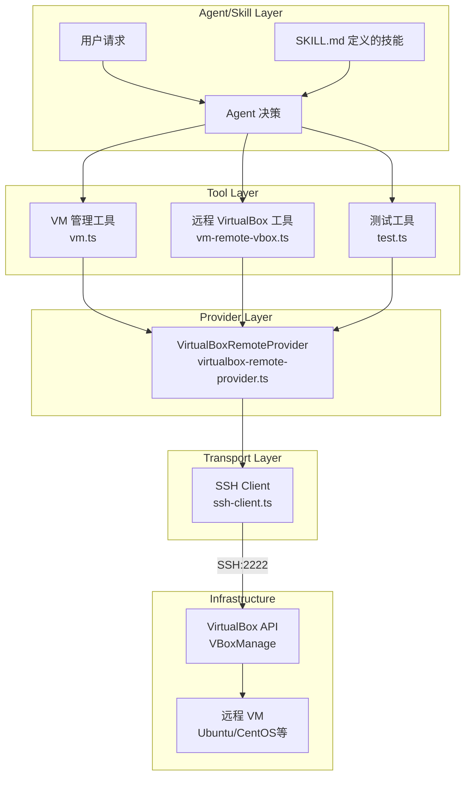

## 2. 组件交互序列图

### 2.1 创建和启动 VM 流程

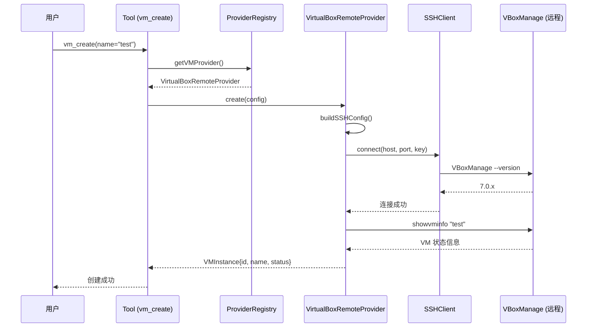

### 2.2 执行命令流程

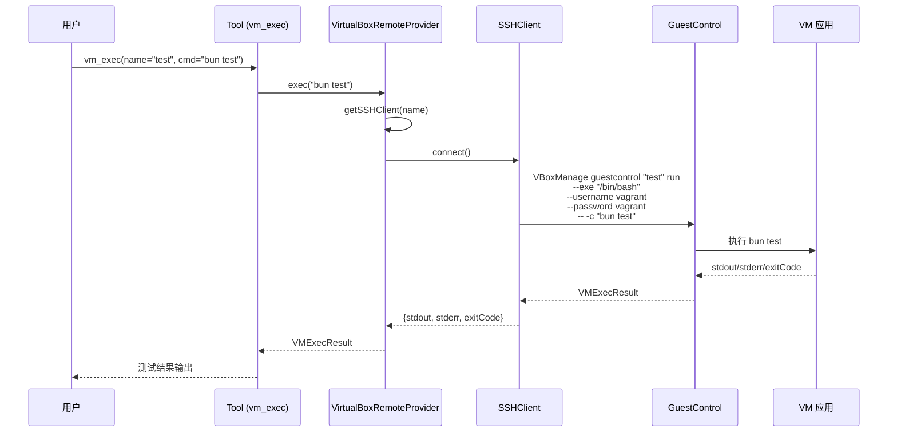

### 2.3 测试完整流程

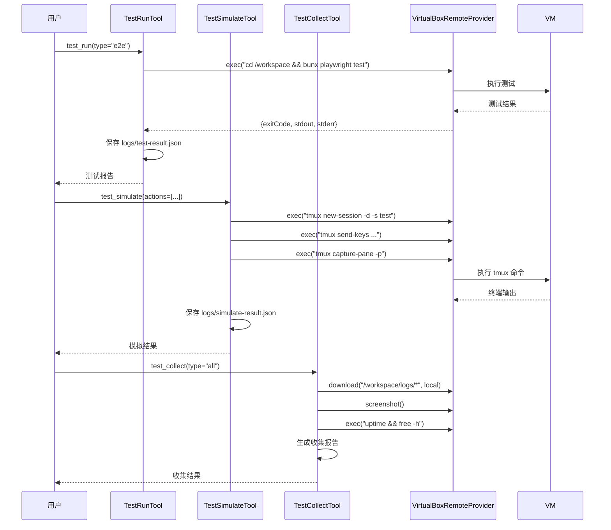

### 2.4 快照管理流程

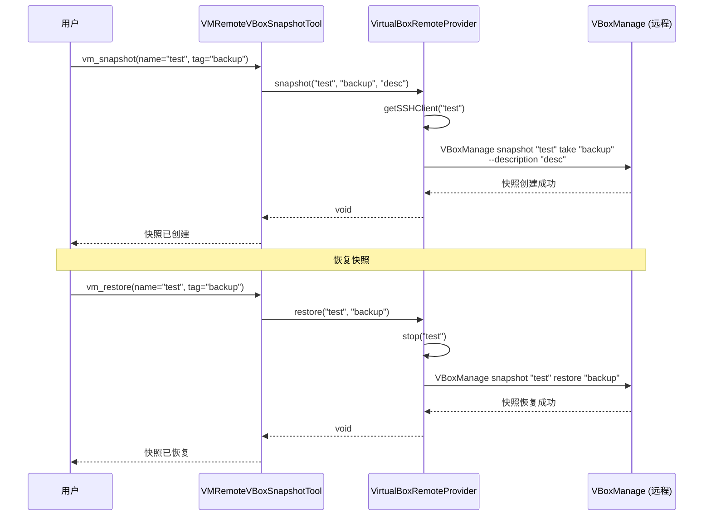

## 3. 数据流图

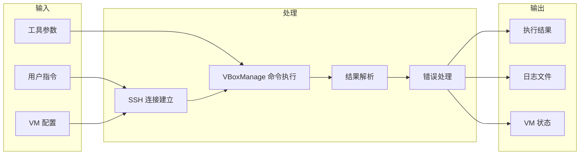

## 4. 状态转换图

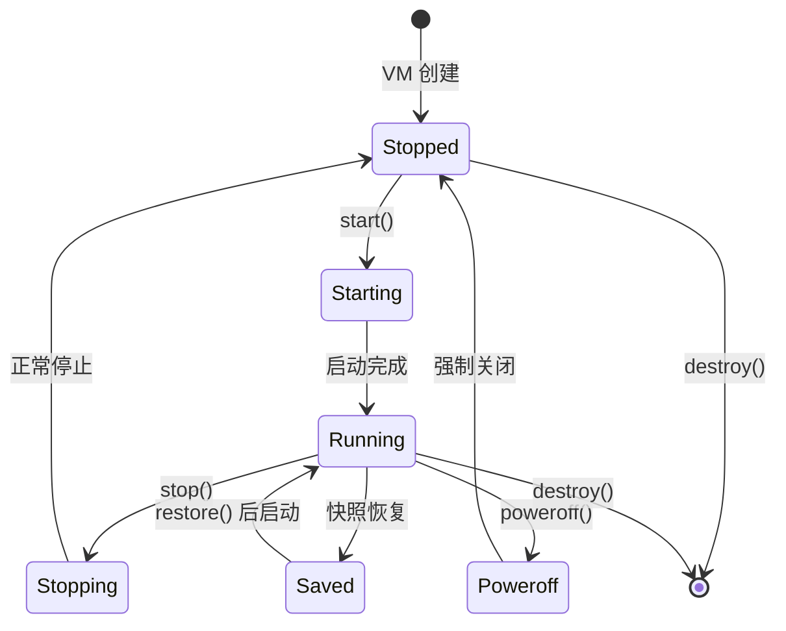

## 5. 文件依赖关系

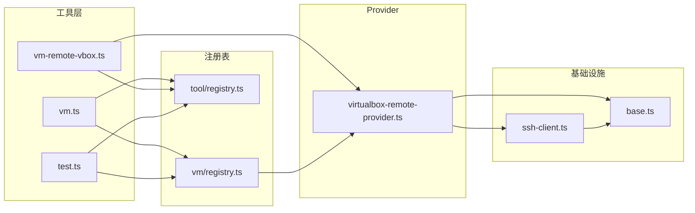

## 6. 部署架构

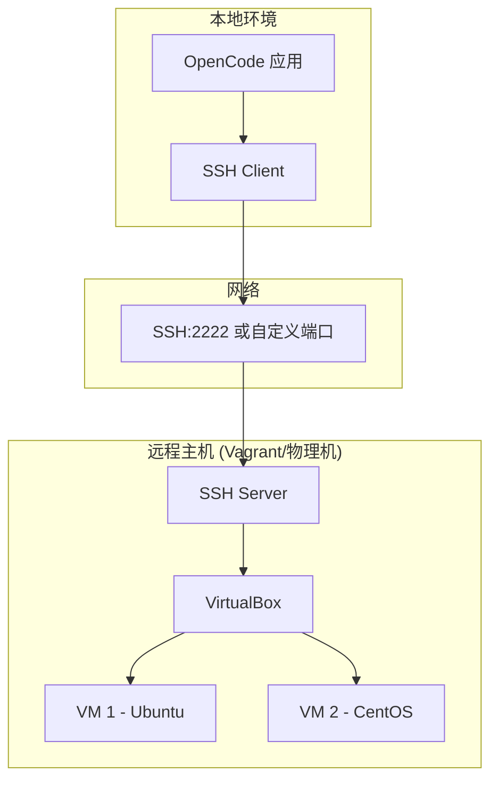

## 7. 安全认证流程

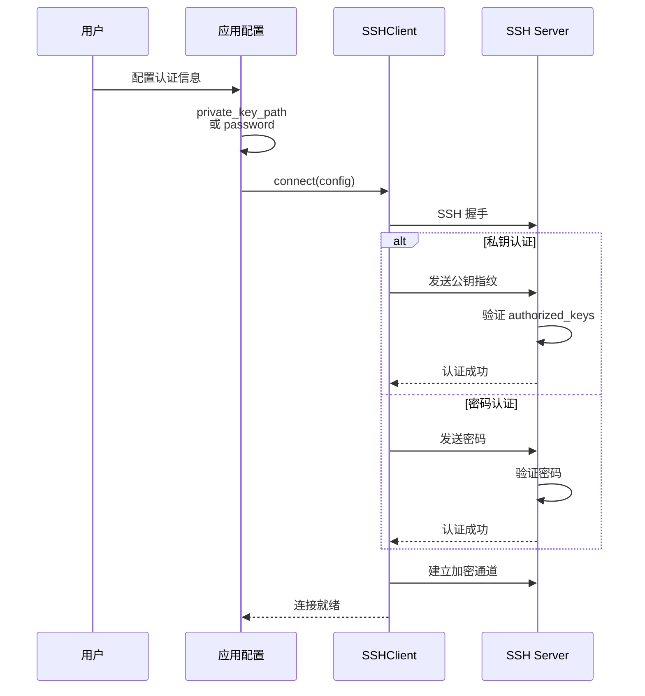

## 8. 错误处理流程

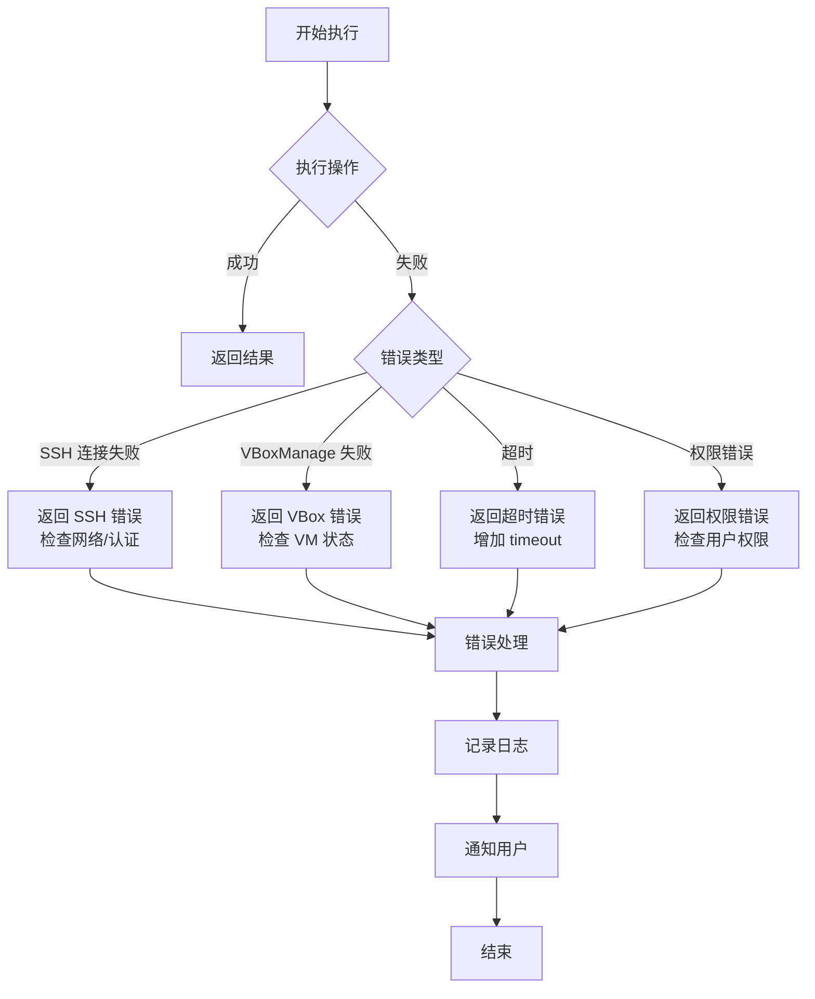

---

## 图例说明

| 符号 | 含义 |
|------|------|
| `->>` | 同步调用 |
| `-->>` | 返回/响应 |
| `->>` | 异步消息 |
| `[...]` | 组件/模块 |
| `(...)` | 参与者/角色 |
| `{...}` | 条件判断 |
| `[...]` | 注释说明 |
